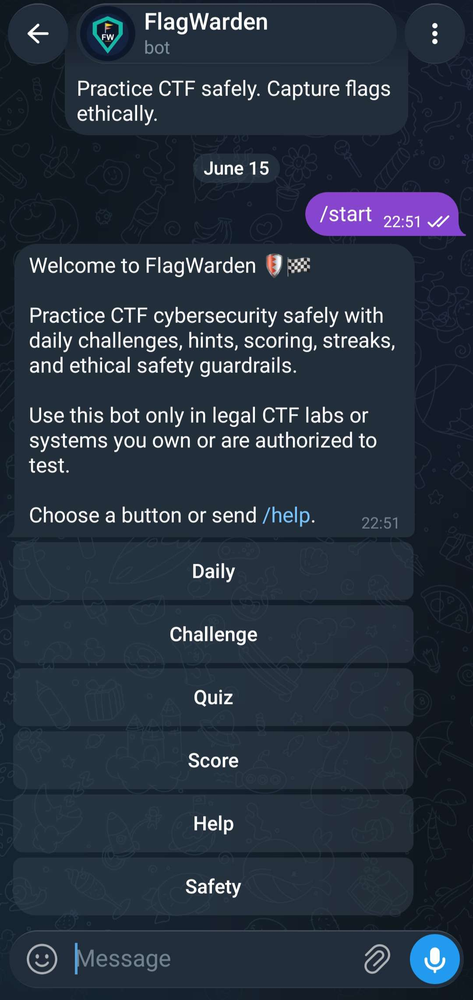
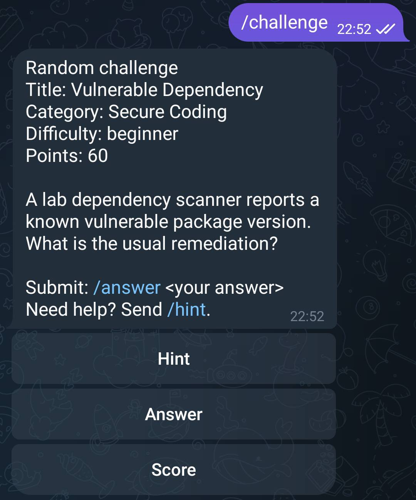
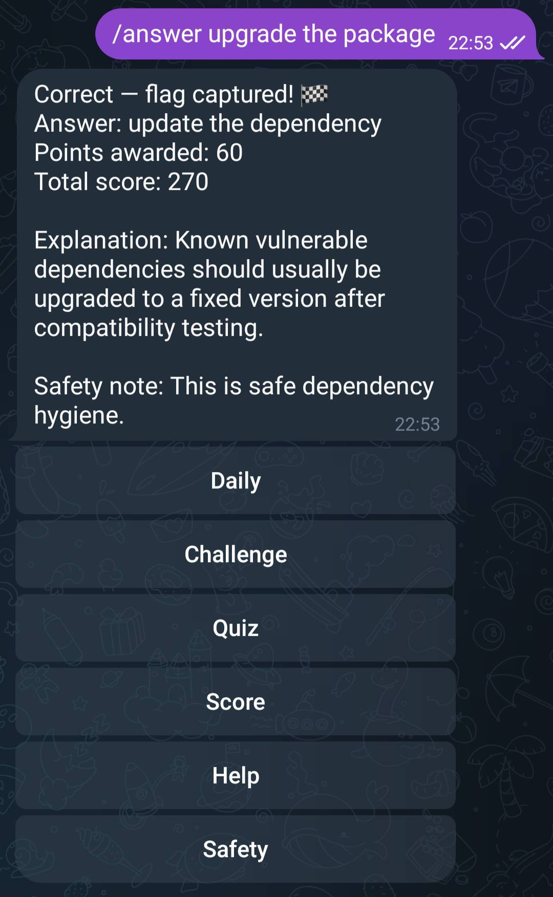
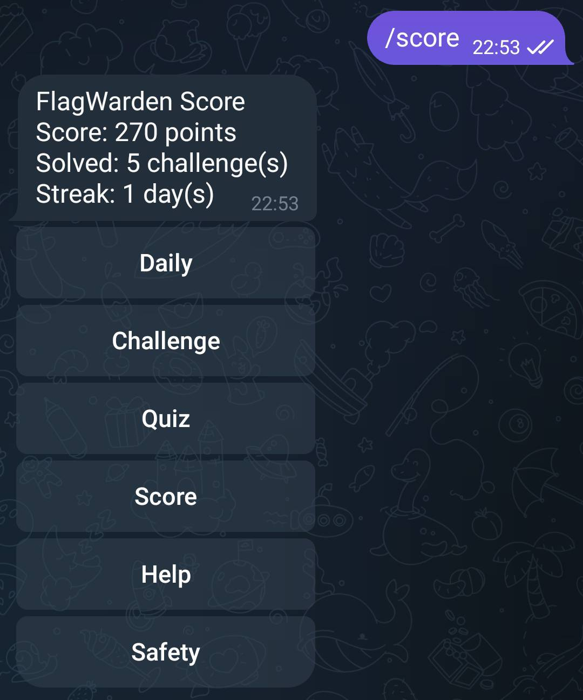
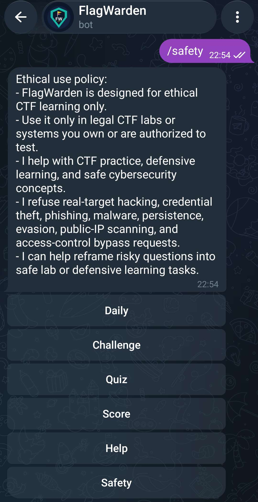

# FlagWarden — Telegram CTF Cybersecurity Learning Bot

FlagWarden is a Telegram bot that helps learners practice CTF cybersecurity challenges safely through daily challenges, hints, scoring, streaks, leaderboards, and ethical safety guardrails. It is designed as a portfolio-ready bot development project demonstrating conversational flow design, webhook-based backend architecture, stateful scoring, testing, and cybersecurity-safe product thinking.

## Overview

FlagWarden focuses on safe, legal CTF learning. Learners can request challenges,
ask for hints, submit answers, track score/streak progress, and review an
ethical-use policy directly inside Telegram.

The backend is intentionally small and readable: FastAPI handles webhooks and
health endpoints, a shared bot flow handles Telegram/WhatsApp-ready commands,
SQLite stores user progress, and deterministic safety rules keep the experience
focused on CTF-only learning.

Short tagline:

```text
Practice CTF safely. Capture flags ethically.
```

## Ethical Scope

FlagWarden is for ethical cybersecurity education, CTF practice, and defensive
learning only.

**Use only in legal CTF labs or systems you own or are authorized to test.**

The bot refuses requests involving real targets, unauthorized access,
credential theft, phishing, malware, persistence, evasion, public-IP scanning,
account takeover, or access-control bypass steps. Cybersecurity content should
remain conceptual, defensive, or isolated-lab/CTF-only.

## Features

- Telegram command-based and inline-button user experience.
- Daily challenge, random challenge, and quiz mode.
- Progressive hints with hint-based score reduction.
- Answer validation with accepted answer aliases.
- Score, solved challenge count, streak tracking, profile, and leaderboard.
- Duplicate solve prevention.
- Rate limiting for excessive answer submissions.
- SQLite persistence for local development.
- FastAPI webhook backend with `/health` and `/metrics`.
- Rule-based safety guardrails for harmful requests.
- WhatsApp adapter included and disabled until valid Meta credentials are configured.
- Optional LLM adapter stub, disabled by default.
- Automated tests and manual QA documentation.

## Screenshots

Capture real Telegram screenshots after the bot is running. Crop screenshots to
hide private usernames, phone numbers, tokens, ngrok URLs, admin panels, and
private chats.

| Flow | Screenshot |
|---|---|
| Start menu |  |
| Challenge |  |
| Correct answer |  |
| Score |  |
| Safety policy |  |

Screenshot guide: [docs/screenshots/README.md](docs/screenshots/README.md)

## Demo

Recommended format: a 30-60 second video or GIF for GitHub, LinkedIn, and
freelance bot developer applications.

- Demo GIF path: `docs/demo/flagwarden-demo.gif`
- Demo script: [docs/demo/demo-script.md](docs/demo/demo-script.md)

Suggested sequence:

1. Send `/start`
2. Open a challenge
3. Request a hint
4. Submit `/answer flag{...}`
5. View `/score`
6. Open `/safety`

Optional GIF helper:

```bash
python -m pip install pillow
python scripts/make_demo_gif.py
```

## Architecture

```text
Telegram Bot API        WhatsApp Cloud API
       |                         |
       v                         v
 app/bot/telegram_adapter.py  app/bot/whatsapp_adapter.py
       |                         |
       +-----------+-------------+
                   v
             app/bot/flow.py
                   |
     +-------------+--------------+
     v             v              v
app/core/     app/core/       app/core/
content.py    quiz_engine.py  safety.py
     |             |              |
     +-------------+--------------+
                   v
          app/db/repository.py
                   |
             SQLite / SQLAlchemy
```

## Tech Stack

- Python 3.11+
- FastAPI
- python-telegram-bot
- WhatsApp Cloud API adapter over HTTP
- SQLite
- SQLAlchemy
- Pydantic and pydantic-settings
- Pytest
- Ruff
- Docker and Docker Compose

## Setup

```bash
python -m venv .venv
. .venv/bin/activate  # Windows PowerShell: .\.venv\Scripts\Activate.ps1
python -m pip install -e ".[dev]"
cp .env.example .env
```

Windows PowerShell:

```powershell
python -m pip install -e ".[dev]"
Copy-Item .env.example .env
notepad .env
```

## Environment Variables

| Variable | Required | Purpose |
| --- | --- | --- |
| `APP_NAME` | No | Public app label, defaults to `FlagWarden` |
| `APP_ENV` | No | Environment label for health/logs |
| `LOG_LEVEL` | No | Logging level |
| `DATABASE_URL` | No | SQLAlchemy database URL |
| `CHALLENGE_DATA_PATH` | No | JSON challenge file path |
| `BOT_TEST_MODE` | No | Keeps local mode explicit |
| `TELEGRAM_BOT_TOKEN` | For Telegram | Enables Telegram webhook processing |
| `WHATSAPP_VERIFY_TOKEN` | For WhatsApp | Enables WhatsApp webhook verification |
| `WHATSAPP_ACCESS_TOKEN` | For WhatsApp | Enables WhatsApp message sending |
| `WHATSAPP_PHONE_NUMBER_ID` | For WhatsApp | WhatsApp Cloud API sender ID |
| `WHATSAPP_API_VERSION` | No | Meta Graph API version |
| `LLM_PROVIDER` | No | Defaults to `none` |
| `LLM_API_KEY` | No | Reserved for future LLM providers |
| `INPUT_MAX_LENGTH` | No | Maximum inbound message length |
| `ANSWER_RATE_LIMIT_COUNT` | No | Max answer attempts per window |
| `ANSWER_RATE_LIMIT_WINDOW_SECONDS` | No | Rate-limit window size |

Do not commit `.env`, bot tokens, Meta tokens, private chat screenshots, or
terminal output that reveals credentials.

## Telegram BotFather Branding

Code cannot reliably rename an existing Telegram bot. Update the live bot
manually in BotFather:

1. Open Telegram and chat with `@BotFather`
2. Run `/mybots`
3. Select the existing bot
4. Choose `Edit Bot`
5. Choose `Edit Name`
6. Set the name to `FlagWarden`
7. Choose `Edit Description`
8. Use: `Practice CTF safely. Capture flags ethically.`
9. Choose `Edit About`
10. Use: `FlagWarden helps learners practice ethical CTF cybersecurity challenges with hints, scoring, streaks, and safety guardrails.`
11. Choose `Edit Botpic`
12. Upload: `assets/logo/flagwarden-logo.png`

If creating a new username, try:

- `@FlagWardenBot`
- `@FlagWardenCTFBot`
- `@FlagWardenCoachBot`
- `@TryFlagWardenBot`

Suggested BotFather command list:

```text
start - Show welcome menu
help - Show available commands
daily - Get today's CTF challenge
challenge - Get a random challenge
quiz - Start quiz mode
hint - Get a hint for current challenge
answer - Submit an answer
score - View score, solved challenges, and streak
profile - View progress by category
leaderboard - View top users
safety - Read the ethical use policy
categories - Browse challenge categories
report - Report an issue or feedback
```

## Running Locally

```bash
python -m uvicorn app.main:app --reload --host 0.0.0.0 --port 8000
```

Open:

- Health: <http://localhost:8000/health>
- Metrics: <http://localhost:8000/metrics>
- API docs: <http://localhost:8000/docs>

## Testing

```bash
python -m pytest
python -m ruff check app tests --no-cache
```

The tests cover content loading, answer validation, scoring, duplicate solve
prevention, safety refusals, repository behavior, config handling, Telegram
adapter routing, WhatsApp parsing, and core bot flows.

## Challenge Format

Each object in [data/challenges.json](data/challenges.json) uses this shape:

```json
{
  "id": "web-002-parameterized-queries",
  "title": "Safer Database Queries",
  "category": "Web",
  "difficulty": "beginner",
  "prompt": "A developer changes string-built SQL into parameterized queries...",
  "answer": "sql injection",
  "acceptable_answers": ["sql injection", "injection"],
  "hints": ["Hint 1", "Hint 2"],
  "explanation": "Parameterized queries bind user input as data...",
  "points": 75,
  "safety_note": "This is defensive secure-coding guidance..."
}
```

## Safety Guardrails

FlagWarden uses deterministic rules in [app/core/safety.py](app/core/safety.py)
to refuse requests involving:

- Real-target hacking or account takeover.
- Unauthorized access.
- Credential, token, cookie, or session theft.
- Phishing or fake login collection.
- Malware, ransomware, keyloggers, backdoors, or destructive payloads.
- Persistence, evasion, stealth, antivirus/EDR bypass.
- Public-IP scanning or enumeration.
- Authentication, 2FA, paywall, or access-control bypass.

Refusals redirect users toward legal CTF labs, toy scenarios, defensive
checklists, and conceptual explanations.

## Manual QA Checklist

Use [docs/manual-qa-checklist.md](docs/manual-qa-checklist.md) before recording
a demo or publishing screenshots. It covers `/start`, `/help`, challenges,
hints, answer submission, repeated solve behavior, score persistence,
fallbacks, safety refusals, screenshots, and BotFather branding.

## Portfolio Highlights

- Telegram bot development with command and inline-button UX.
- FastAPI webhook backend.
- Stateful user progress with SQLite persistence.
- Challenge engine for daily/random CTF prompts.
- Scoring and streak logic.
- Duplicate solve prevention.
- Answer rate limiting.
- Safety guardrails for ethical, CTF-only learning.
- Manual QA and automated tests.
- WhatsApp-ready architecture with adapter disabled until Meta credentials are configured.

## Resume Bullets

- Built FlagWarden, a Telegram-based CTF Cybersecurity Learning Bot with interactive challenge flows, hints, answer validation, scoring, streak tracking, and safety guardrails.
- Implemented command-based and button-based conversational UX for daily challenges, random challenges, quizzes, score tracking, and ethical-use policy.
- Designed stateful user progress with SQLite persistence, duplicate solve prevention, hint-based score reduction, and rate limiting.
- Developed a FastAPI webhook backend with health/metrics endpoints and automated tests for challenge logic, scoring, safety refusal, repository/database behavior, and bot adapters.
- Prepared portfolio documentation with setup instructions, screenshot guide, demo script, LinkedIn post draft, manual QA checklist, and Telegram BotFather branding guide.

## LinkedIn Project Description

I built FlagWarden, a Telegram-based CTF Cybersecurity Learning Bot designed
for safe and ethical cybersecurity practice. It supports daily challenges,
random CTF challenges, hints, answer validation, scoring, streak tracking,
leaderboards, and safety guardrails that keep the experience focused on legal
CTF labs and authorized environments. This project helped me practice bot
development, conversational flow design, state management, FastAPI webhook
architecture, SQLite persistence, testing, and cybersecurity-safe product
design.

## Future Improvements

- Admin dashboard for reviewing reports and challenge analytics.
- Scheduled daily challenge reminders.
- Per-category badges and achievements.
- Postgres deployment profile for hosted environments.
- Signed Telegram webhook secret validation.
- Richer WhatsApp Cloud API menu support.
- Optional LLM provider constrained to CTF-safe conceptual hints.

