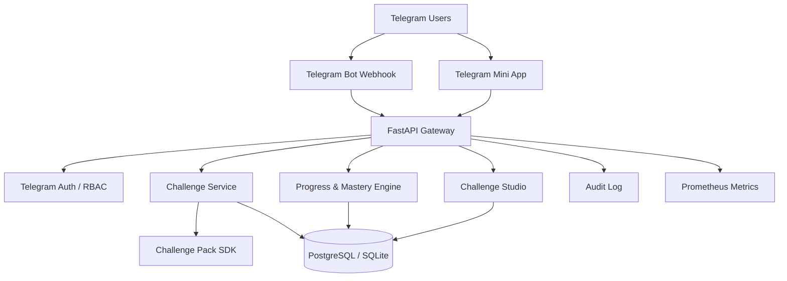

# 🛡️ FlagWarden 2.0

**Security-First CTF Learning & Challenge Management Platform for Telegram**

FlagWarden 2.0 turns the original Telegram CTF learning bot into a recruiter-ready security engineering project. It keeps the original learning loop—challenges, hints, scoring, streaks, progress tracking, safety guardrails, FastAPI, and automated testing—while adding a secure challenge SDK, PostgreSQL-ready persistence, webhook hardening, Telegram Mini App authentication, RBAC challenge authoring, adaptive skill tracking, security regression tests, observability, and DevSecOps automation.

> This repository is designed for **legal CTF/lab learning only**. It does not target third-party systems and intentionally excludes autonomous exploitation and real-target scanning.

## Why this project is different

Instead of being only a bot, FlagWarden is structured as a small security product:

- **Telegram Bot** — daily/random challenges, hints, submissions, scoring, streaks
- **Challenge Pack SDK** — versioned YAML challenges, schema validation, secure answer verification
- **Learning Engine** — skill mastery, post-solve debriefs, deterministic recommendations
- **Telegram Mini App** — dashboard, progress, recommendations, challenge browser
- **Challenge Studio API** — Author → Reviewer → Admin workflow with RBAC
- **Security Controls** — webhook secret validation, update idempotency, HMAC answer verification, Mini App init-data validation, audit logging, rate limiting
- **Production-style backend** — FastAPI, SQLAlchemy, Alembic, PostgreSQL support, Docker Compose
- **Quality & DevSecOps** — Pytest, optional Hypothesis property tests, CodeQL, Bandit, pip-audit, Dependabot, container build checks
- **Observability** — liveness/readiness endpoints, Prometheus metrics, structured audit events

## Architecture


```mermaid
flowchart TB
    TG[Telegram Users] --> BOT[Telegram Bot Webhook]
    TG --> MINI[Telegram Mini App]
    BOT --> API[FastAPI Gateway]
    MINI --> API
    API --> AUTH[Telegram Auth / RBAC]
    API --> CH[Challenge Service]
    API --> LEARN[Progress & Mastery Engine]
    API --> STUDIO[Challenge Studio]
    CH --> PACKS[Challenge Pack SDK]
    CH --> DB[(PostgreSQL / SQLite)]
    LEARN --> DB
    STUDIO --> DB
    API --> AUDIT[Audit Log]
    API --> METRICS[Prometheus Metrics]
```

## Security highlights

1. **Webhook authentication** via `X-Telegram-Bot-Api-Secret-Token`.
2. **Idempotent update processing** using a unique Telegram `update_id` record.
3. **HMAC-based answer verification**—answers do not need to be stored in plaintext.
4. **Per-user dynamic flags** supported by `dynamic_hmac` verifier.
5. **Mini App `initData` verification** on the backend before trusting Telegram identity.
6. **RBAC** roles: `USER`, `AUTHOR`, `REVIEWER`, `ADMIN`.
7. **Challenge lifecycle**: Draft → Review → Approved → Published → Deprecated.
8. **Sanitized audit logging**—no bot tokens, flags, or raw session data in logs.
9. **Rate limiting** with in-memory default and a clean adapter boundary for Redis.
10. **Security regression testing** around scoring, duplicate solves, webhook replay, auth, and verifier behavior.

## Quick start

```bash
cp .env.example .env
python -m venv .venv
source .venv/bin/activate  # Windows: .venv\Scripts\activate
pip install -e '.[dev]'
python -m flagwarden.cli pack validate challenge_packs/starter-pack
uvicorn flagwarden.main:app --reload
```

Open:
- API docs: `http://127.0.0.1:8000/docs`
- Mini App demo: `http://127.0.0.1:8000/app/`
- Health: `http://127.0.0.1:8000/health/live`
- Metrics: `http://127.0.0.1:8000/metrics`

### Docker

```bash
docker compose up --build
```

The default Compose stack uses PostgreSQL. Local development can still use SQLite through `DATABASE_URL`.

## Challenge Pack SDK

```text
challenge_packs/
└── starter-pack/
    ├── pack.yaml
    └── challenges/
        ├── web-basics-001.yaml
        └── forensics-basics-001.yaml
```

Validate a pack:

```bash
python -m flagwarden.cli pack validate challenge_packs/starter-pack
```

Generate a secure answer digest:

```bash
python -m flagwarden.cli answer digest 'your-answer'
```

The demo pack uses a **development-only pepper** from `.env.example`. Rotate it for any real deployment.

## Mini App authentication

The frontend sends Telegram's raw `initData` to the backend. The backend validates the HMAC signature and checks `auth_date` freshness before using the Telegram user identity. A development-only debug identity header is available only when explicitly enabled.

## Testing

```bash
pytest -q
```

Optional property-based tests:

```bash
pip install -e '.[property-tests]'
pytest -q tests/property
```

## Repository map

```text
flagwarden/                 Python application
challenge_packs/            Versioned challenge content
miniapp/                    Telegram Mini App dashboard
alembic/                    Database migrations
scripts/                    Setup and validation helpers
tests/                      Unit/integration/security tests
docs/                       PRD, architecture, threat model, testing, authoring
.github/workflows/          CI + security automation
```

## Recruiter demo flow (60–90 seconds)

1. Show the architecture diagram.
2. Run the Challenge Pack validator.
3. Open the Mini App dashboard.
4. Show a challenge assignment and hint penalty.
5. Submit a correct answer and show mastery/progress update.
6. Replay the same webhook/update and show idempotent behavior.
7. Show a Challenge Studio draft moving through review/publish states.
8. Show CI/security checks and the threat model.

## Migration from FlagWarden 1.x

See [`docs/MIGRATION_GUIDE.md`](docs/MIGRATION_GUIDE.md). The v2 codebase is intentionally modular so the existing challenge content and Telegram copy can be migrated without preserving old technical debt.

## Safety

FlagWarden is intentionally scoped to educational CTF/lab content. See [`SECURITY.md`](SECURITY.md) and [`docs/THREAT_MODEL.md`](docs/THREAT_MODEL.md).
